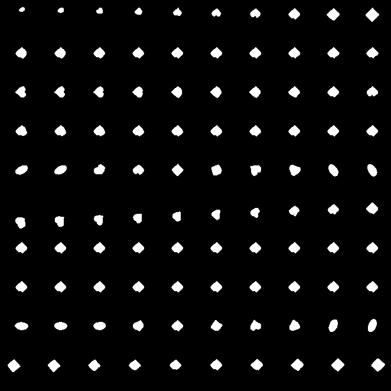

# Disentangled VAE

Pytorch implementation of VAEs for unsupervised disentangled representation learning.

## Plans

+ Models:
    - [x] VAE
    - [x] BetaVAE
    - [x] AnnealVAE
    - [ ] DIP-VAE
    - [ ] beta-TCVAE
    - [ ] FactorVAE
+ Metrics:
    - [x] BetaVAE Scores
    - [ ] FactorVAE Scores
    - [ ] MIG
    - [ ] SAP

This codes only supports `dsprites` dataset right now. And more training results will be
released recently.

Besides, I found it hard to get an impressive disentangling results, which means that it's not
so easy to reimplement the results in paper. I think it may be due to the well-known unidentifiablity problem
of this kind of unsupervised representation methods. 
Here are things I found useful in experiment:

+ annealing methods is worth trying, it's more easier to train than `BetaVAE`.
+ `binary_cross_entropy` is useful for `dsprites`.

## Training Results

| AnnealVAE | BetaVAE scores |
| -- | -- |
|  | 0.8114333371321361 |

The model learned some factors( size, shape, y-shift, x-shift in 1st, 5th, 6th, 9th components ),
but did not exhibit well-disentangled behaviour.

